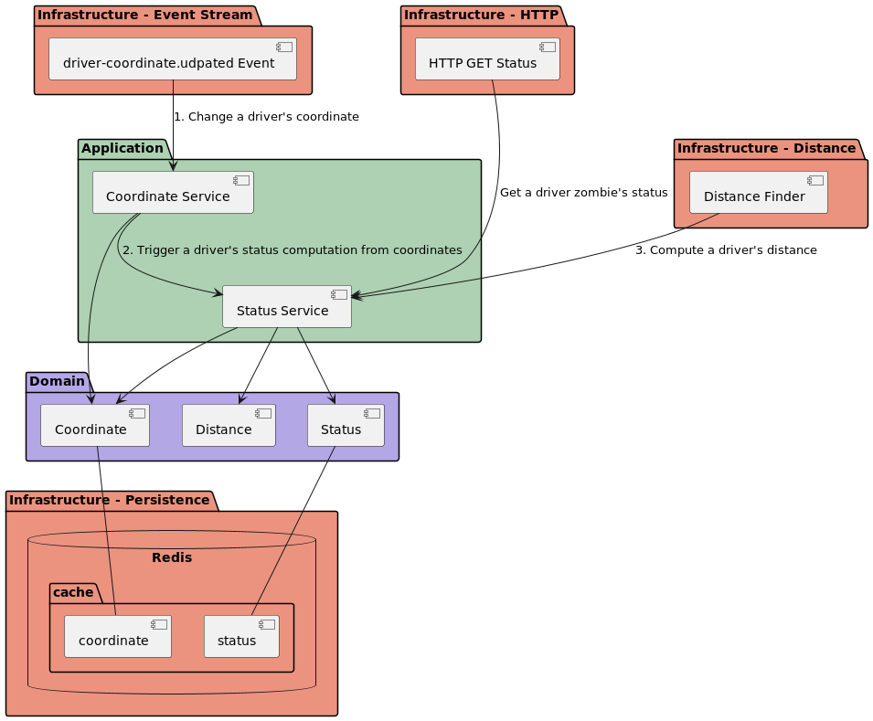

### Functional requirements

- Send driver's location updates from mobile and forward them to a broker (let's say every 10s)
- Store locations, compute if a driver is moving or not
- A driver status is not moving if he has driven less than 500 meters in the last 5 minutes

### Geo-Tracking service

The service has two main features:
- compute and stores driver's status (isZombie) asynchronously consuming driver coordinate updated events. As such, the service leverages reactive caching,
- serve a driver's status synchronously through HTTP GET requests.

This service has been built following several architecture paradigms:
- [Hexagonal](https://alistair.cockburn.us/hexagonal-architecture/)
- [Domain-Driven Design](https://martinfowler.com/bliki/DomainDrivenDesign.html) (DDD)
- [Command and Query Separation](https://martinfowler.com/bliki/CommandQuerySeparation.html) (CQS)
- [Even Driven Architecture](https://martinfowler.com/articles/201701-event-driven.html) (EDA)
- [SOLID](https://en.wikipedia.org/wiki/SOLID) principles

### Architecture



### Distance Formula

Distance are commonly computed through Haversine or Vincenty formulas with slightly different results. 
Either distance formulas can be used in the service using application configuration. [Strategy design pattern](https://en.wikipedia.org/wiki/Strategy_pattern) 
was an ideal candidate.

### Testing Strategy

For the sake of time, critical aspects are covered by unit tests and integration tests.
- unit tests cover algorithm in charge of computing distance between coordinates
- integration tests cover the whole application workflow: 
  - produce coordinate events, which will update store with driver's coordinates and isZombie status
  - retrieve a driver isZombie status

### Setup

- Go >= 1.18
- Docker >= 23.0.4

### Start infrastructure - services used by GT

Start the infrastructure by running:

```bash
$ make infra-up
```

Stop the infrastructure by running:
```bash
$ make infra-down
```

### Start services in dev mode

```bash
$ make build
$ ./build/pim s
```

Access pages locally, such as:
- http://localhost/healthz
- http://localhost/status?driver_id=123

Note: driver's coordinate and status are updated through events. 
- Events can be easily produced running integration test ./integration/http_status_v1
- You will need to have ginkgo testing framwework installed https://onsi.github.io/ginkgo/#installing-ginkgo

